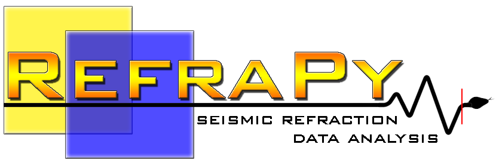

Refrapy is a graphical application for seismic refraction data analysis. It is written in Python and uses 
open source libraries from numerical and geophysics python communities to 
provide a visual interface for geophycists analyse seismic refraction data.

## Installation

Before proceeding it should be advised that currently Refrapy only works with python versions from 3.9 to 3.12 
and that it depends on tkinter, which comes with python but is an optional dependency in some python distributions.

Below we provide installation methods for a variety of command line tools including: pipx and uv. 

<!-- , pip/venv, and conda. -->

### Installing Refrapy with pipx
```bash
pipx install git+https://github.com/AlgoSismos/Refrapy
```

pipx is a community tool for installing stand-alone python applications from Python Package Index (PYPI). 
It installs the application in an isolated environment and makes it available in the user space 
without affecting other environments. 

For pipx installation instructions and usage see its [official documentation](https://pipx.pypa.io/stable/docs/).

### Installing Refrapy with uv

```bash
uv tool install --python-preference only-system git+https://github.com/AlgoSismos/Refrapy
```

<!-- ### Installing Refrapy using pip/env


### Installing Refrapy using conda

THE DESCRIPTION BELOW IS OUTDATED:

It is recommended the use of Anaconda (https://www.anaconda.com/), because it simplifies package management.
Once it is installed, run the following commands on the Anaconda prompt (**tested on Windows 10 system, with Python 3.8.13**):

   ```
   conda create -n refrapy python=3.8
   conda activate refrapy
   conda install obspy
   conda install -c gimli -c conda-forge pygimli
   pip install pmw
   ```
    
Once all the necessary packages are installed, extract Refrapick.py, Refrainv.py and the images folder to a directory on your computer. Sample data are also available for download.

You can execute the Python files by running:

   ```
   python Refrapick.py
   python Refrainv.py
   ``` -->

## Using Refrapy

There are two applications bundled with Refrapy, Refrapick and Refrainv. 

### Refrapick

The Refrapick program is used for basic waveform processing and for first breaks picking. The software is aimed to work mainly around SEG2 files, but all waveform formats readable by ObsPy (https://www.obspy.org/) can be used. However, there are a few conditions that need to be considered when reading multichannel waveform data. Waveform **files with missing data traces cannot be used as input**, which can occur with files that have already passed through some other processing software, where one or more traces were removed manually, probably due to being bad noisy data. Thus, **it is recommended the use of original files (i.e., without any editing)**. Also, receivers and source position may not be well defined in the file header or may fail to be properly read. **In such cases, instead of obtaining this information automatically (conventional attempt), dialog boxes appear so that the user can enter these required values**.

For calling Refrapick, on your terminal, call:
```bash
refrapy pick
```

For usage, follow the instructions on the video below:

[](https://www.youtube.com/watch?v=3a9eZW4WKjI)


### Refrainv

The Refrainv program is used to run a time-terms and a traveltimes tomography inversion. The latter is powered by pyGIMLi (https://www.pygimli.org/). The program presents an individual frame for each inversion method, where each frame has three main panels: the traveltime plotting panel (upper left), used to view and interact with the observed data; the fit and editing panel (upper right), used to edit traveltimes, by clicking on data points and dragging them up or down, and to view the graphical fit between the observed and calculated traveltimes; and the velocity model plotting panel (bottom). 

For calling Refrapick, on your terminal, call:
```bash
refrapy inv
```

For usage, follow the instructions on the video below:

[](https://www.youtube.com/watch?v=rOJjxoc2cbU)

<!-- ## Reporting errors and asking questions

We encourage users to open an issue in this repository when encountering an error or when in doubt about a functionality or any other subject regarding the use of the software. Please keep in mind that, in its current state, Refrapy is mantained by few active contributors that are not always available for development, so bug fixing might take some time to be properly adressed. -->

## Acknowledgement and citation

If you use Refrapy in your work please cite the following paper:

*Guedes, V.J.C.B., Maciel, S.T.R., Rocha, M.P., 2022. Refrapy: A Python program for seismic refraction data analysis, Computers and Geosciences. https://doi.org/10.1016/j.cageo.2021.105020.*
